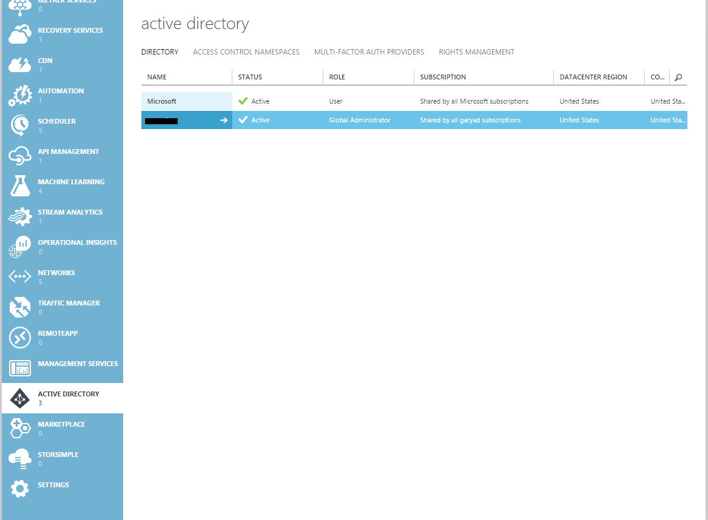
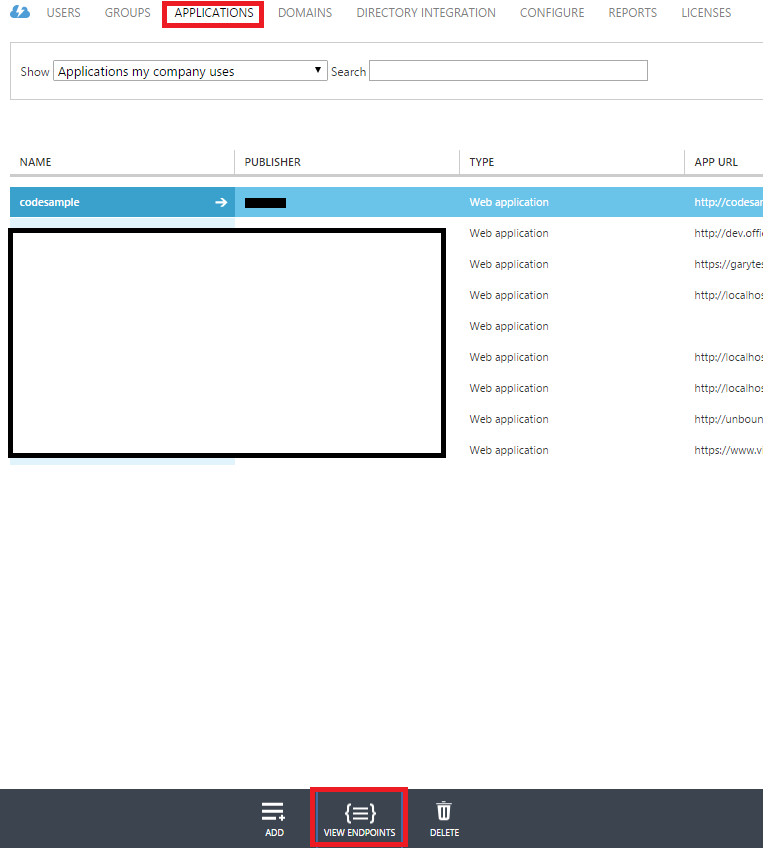
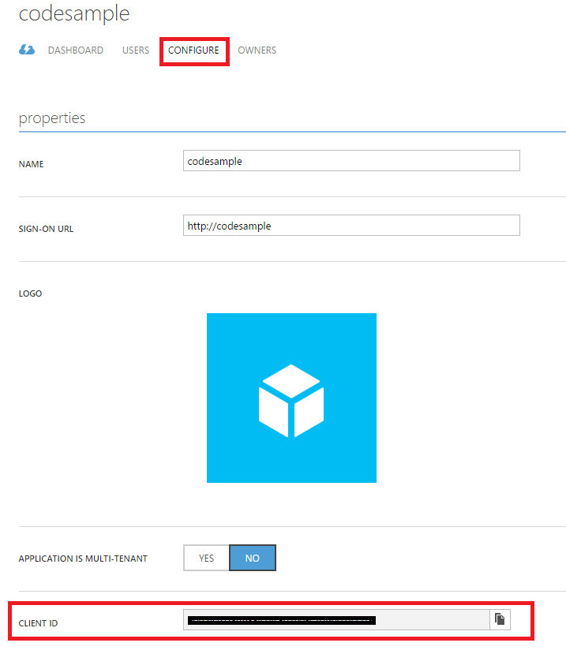
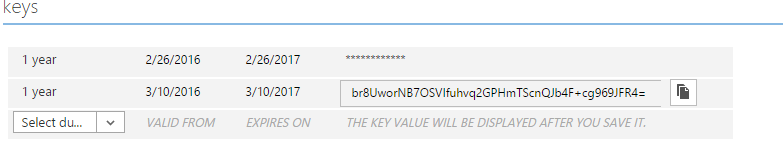
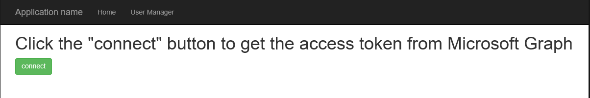
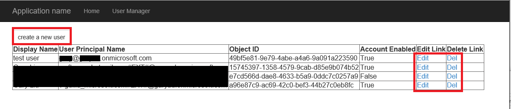
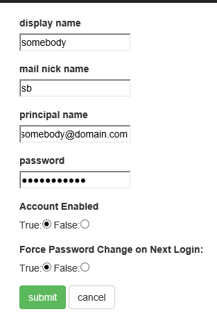
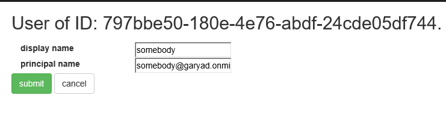
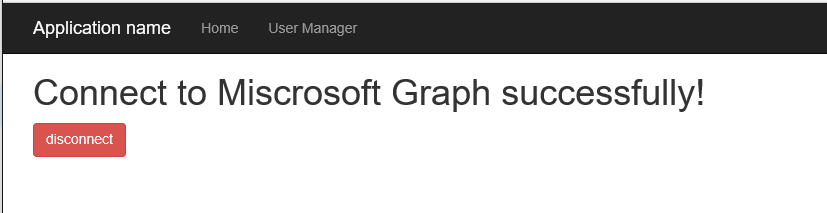

# PHP App-Only sample for Microsoft Graph

## About this sample
This PHP sample application demonstrates how to Read and Write AAD users in tenant of Microsoft Azure Active Directory with using the Microsoft Graph API, which is a new RESTful interface that allows programmatic access to AAD user data in tenant. The Graph API is now GA. Graph service enables developers to incorporate new capabilities with existing applications and to build new applications that leverage directory data access to Microsoft Azure AD.

Please refer to [AAD Graph team blog](http://blogs.msdn.com/b/aadgraphteam/) on MSDN to learn more about Microsoft Azure Active Directory Graph Service.

This sample performs HTTP requests and reads JSON format responses from Graph service. More details about HTTP requests and JSON responses from Graph service, please refer to [http://blogs.msdn.com/b/aadgraphteam/archive/2013/01/15/understanding-azure-active-directory-graph-operations.aspx](http://blogs.msdn.com/b/aadgraphteam/archive/2013/01/15/understanding-azure-active-directory-graph-operations.aspx).

The main logic code in this sample is written in **CurlHelper.php**, **Operations.php** files.

The **CurlHelper.php** file build a helper class for implement HTTP requests via cURL in PHP.

The **Operations.php** file contains the code which builds the request for involing the Graph REST APIs..

- connect function demonstrates how to apply for an access token from Microsoft Graph and save it in cookies.
- getUser function demonstrates how to query all users' (or specific user with user's id) info in tenant and list them on the page.
- addUser function demonstrates how to create a new user in tenant.
- editUser function demonstrates how to update a user's info in tenant.
- delUser function demonstrates how to delelt a user in tenant.

You can refer to [Graph REST API reference](http://graph.microsoft.io/en-us/docs/api-reference/v1.0/resources/user) to understand more details.

The Graph API is compatible with OData V3 and enables applications to construct more complex queries. The sample application is authenticated with Graph API by presenting a token that is issued by Microsoft Azure Access Control Service using OAuth 2.0. The sample application is authorized in [Service to Service Calls Using Client Credentials](https://msdn.microsoft.com/en-us/library/azure/dn645543.aspx?f=255&MSPPError=-2147217396) flow to read user information from a demonstration Azure AD company. To execute Write Operations for your company's data (Create, Delete, Update), it's needed to use your own Azure AD company and upgrate role of the AD application you use with a administrator permission (the PowerShell script shown as below is guiding us to konw how to do it).

```
#use the administrator account to sign in
    Connect-MsolService
    $ClientIdWebApp = '{your_AD_application_client_id}'
    $webApp = Get-MsolServicePrincipal -AppPrincipalId $ClientIdWebApp
#use Add-MsolRoleMember to add it to "Company Administrator" role).
    Add-MsolRoleMember -RoleName "Company Administrator" -RoleMemberType ServicePrincipal -RoleMemberObjectId $webApp.ObjectId
```

## Deploy this sample to Azure
- Before running this code sample, please open **Settings.php** in the **app** directory.

    Here it's needed to use tenant ID, client ID and secret key for setting up a correct configuration. Login [Azure Manage Portal](https://manage.windowsazure.com/), click the **ACTIVE DIRECTORY** on the left navigation bar, find your AD tenant on the right side list.

    


- Replace **ENTER_YOUR_TENANT_ID** with your Azure AD tenant ID in **Settings.php**.

    Click the **APPLICATIONS** button on the top navigation bar. Find the **VIEW ENDPOINTS** at bottom, get something like xxxxxxxx-xxxx-xxxx-xxxx-xxxxxxxxxxxx

    

- Replace **ENTER_YOUR_CLIENT_ID** with the client ID of your registered Azure application in **Settings.php**.

    Click the application name you will use in the list. Then click the **CONFIGURE** tab at top. Under the **properties** section, get the **CLIENT ID** clientId.

    

- In **Settings.php**, replace **ENTER_YOUR_SECRET** with a key generated on the **Configure** page of your app in the Microsoft Azure Management Portal.

    Scroll down to the **key** section. Select an option of the Select duration select, click the **SAVE** button on the bottom. After AD saved configurations, you can get the secret key.

    

## Building the sample

- (Optional) You can use [WebMatrix](http://www.microsoft.com/web/webmatrix/) to work with this PHP sample. WebMatrix is a free and light weight tool that will let you create web sites using various technologies like PHP, Asp.Net, Node.js etc. In order to run this sample in Web matrix, choose "Open Site" -> "Folder as Site" and select the folder that contains all the downloaded files.

- (Optional) You can use [PHP Build-in web server](http://php.net/manual/en/features.commandline.webserver.php) for a quick locally test.

    Tpye following command in cmdlet in the code sample directory:

    ```
    $ php -S localhost:8000
    ```

## Tour the sample
- Click the **connect** button in the home page to get the access token from Microsoft Graph.



- Click the **User Manager** button on the top nav bar to redirect to the page that contains the users' list.



- Perform CURD operations for these users' info.
  - Add user:

  
  - Edit user:

  
- Click the **disconnect** button in the home page to remove the access token cookies.

    

## More information
- Overview of Microsoft Graph: [http://graph.microsoft.io/en-us/docs/overview/overview](http://graph.microsoft.io/en-us/docs/overview/overview)
- Microsoft Azure Active Directory GitHub repository:
[https://github.com/AzureAD](https://github.com/AzureAD)
- The main cURL functions reference to: [PHP Curl Class](https://github.com/php-curl-class/php-curl-class#php-curl-class-http-requests-made-easy)
